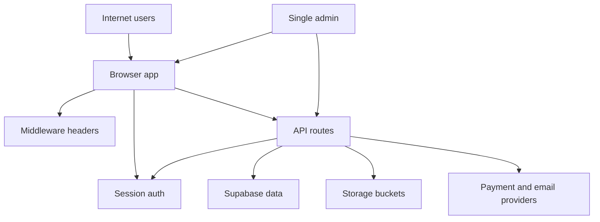

## Executive summary

This repository is a public internet-facing Next.js marketplace and operations platform for events, groups, venues, and a single super-admin. The highest-risk theme is a mismatch between the intended production posture and the current runtime posture: the schema and route surface are already designed for real auth, payments, messaging, bookings, and admin control, but the active app still relies on mock auth/session behavior and scaffolded API integrations in key areas. The most important review areas are the auth boundary, future payment/webhook implementation, RLS-to-route consistency, and abuse resistance for public and admin-sensitive flows.

## Scope and assumptions

- In scope:
  - Runtime web app and route handlers under [src/app](/Users/baldvinoddsson/Desktop/Meetupreykjavik/src/app/layout.tsx)
  - Auth/session helpers under [src/lib/auth](/Users/baldvinoddsson/Desktop/Meetupreykjavik/src/lib/auth/mock-auth.ts)
  - API route surface and manifest in [src/app/api/[...path]/route.ts](/Users/baldvinoddsson/Desktop/Meetupreykjavik/src/app/api/[...path]/route.ts) and [src/lib/api/spec-routes.ts](/Users/baldvinoddsson/Desktop/Meetupreykjavik/src/lib/api/spec-routes.ts)
  - Middleware and browser security headers in [middleware.ts](/Users/baldvinoddsson/Desktop/Meetupreykjavik/middleware.ts)
  - Planned Supabase schema and storage config in [supabase/schema.sql](/Users/baldvinoddsson/Desktop/Meetupreykjavik/supabase/schema.sql) and [supabase/storage.sql](/Users/baldvinoddsson/Desktop/Meetupreykjavik/supabase/storage.sql)
- Out of scope:
  - Dev-only preview servers, local ownership-map artifacts, and unrelated parent-repo projects
  - CI/CD and infrastructure not present in this repo
- Explicit assumptions:
  - The app will launch publicly on the open internet.
  - Real payments and real user/business data will be processed at launch.
  - There will be one powerful admin operator, not a multi-admin hierarchy.
  - Supabase is intended to become the production auth/data boundary, but the current runtime still uses mock auth when env is absent.

Open questions that would materially change risk ranking:
- Whether launch blocks until mock auth and scaffolded payment/email routes are fully replaced.
- Whether PayPal webhooks and cron routes will be deployed in the same Next.js app or delegated to separate workers/functions.

## System model
### Primary components

- Public Next.js frontend and role portals:
  - public marketplace, member dashboard, organizer dashboard, venue dashboard, admin dashboard under [src/app](/Users/baldvinoddsson/Desktop/Meetupreykjavik/src/app/layout.tsx)
- Route-handler API layer:
  - central dynamic API router in [src/app/api/[...path]/route.ts](/Users/baldvinoddsson/Desktop/Meetupreykjavik/src/app/api/[...path]/route.ts)
- Session and role gating layer:
  - current mock cookie session in [src/lib/auth/mock-auth.ts](/Users/baldvinoddsson/Desktop/Meetupreykjavik/src/lib/auth/mock-auth.ts)
  - role guard redirects in [src/lib/auth/guards.ts](/Users/baldvinoddsson/Desktop/Meetupreykjavik/src/lib/auth/guards.ts)
- Middleware/browser policy layer:
  - CSP, basic headers, locale cookie setup in [middleware.ts](/Users/baldvinoddsson/Desktop/Meetupreykjavik/middleware.ts)
- Planned persistent backend:
  - Supabase SSR/browser clients in [src/lib/supabase/server.ts](/Users/baldvinoddsson/Desktop/Meetupreykjavik/src/lib/supabase/server.ts) and [src/lib/supabase/client.ts](/Users/baldvinoddsson/Desktop/Meetupreykjavik/src/lib/supabase/client.ts)
  - schema, helpers, and RLS in [supabase/schema.sql](/Users/baldvinoddsson/Desktop/Meetupreykjavik/supabase/schema.sql)
  - public asset buckets in [supabase/storage.sql](/Users/baldvinoddsson/Desktop/Meetupreykjavik/supabase/storage.sql)
- Planned external integrations:
  - payments/webhooks/messages/notifications/cron routes declared in [src/lib/api/spec-routes.ts](/Users/baldvinoddsson/Desktop/Meetupreykjavik/src/lib/api/spec-routes.ts)

### Data flows and trust boundaries

- Internet user -> Next.js pages and route handlers
  - Data: credentials, profile data, event/group/venue actions, comments, ratings, booking requests
  - Channel: HTTPS
  - Security guarantees: CSP and browser headers in middleware; some origin enforcement on state-changing routes; no visible rate limiting
  - Validation: Zod body validation for many route patterns in [src/app/api/[...path]/route.ts](/Users/baldvinoddsson/Desktop/Meetupreykjavik/src/app/api/[...path]/route.ts)
- Browser -> session cookie / locale cookie
  - Data: mock session cookie, locale preference
  - Channel: cookie over HTTPS in production
  - Security guarantees: mock session cookie is signed and `HttpOnly`; locale cookie is non-`HttpOnly`; `SameSite=Lax`
  - Validation: session signature verification in [src/lib/auth/mock-auth.ts](/Users/baldvinoddsson/Desktop/Meetupreykjavik/src/lib/auth/mock-auth.ts)
- Next.js server -> Supabase
  - Data: user identity, profiles, groups, venues, events, payments, messages, notifications
  - Channel: Supabase client over HTTPS
  - Security guarantees: intended RLS and helper functions in [supabase/schema.sql](/Users/baldvinoddsson/Desktop/Meetupreykjavik/supabase/schema.sql)
  - Validation: runtime env gating in [src/lib/supabase/server.ts](/Users/baldvinoddsson/Desktop/Meetupreykjavik/src/lib/supabase/server.ts)
- Next.js server -> external payment/email/cron/webhook providers
  - Data: charges, subscription actions, reminders, digests, webhook payloads
  - Channel: HTTPS/webhooks
  - Security guarantees: not implemented yet in code; only route declarations exist in [src/lib/api/spec-routes.ts](/Users/baldvinoddsson/Desktop/Meetupreykjavik/src/lib/api/spec-routes.ts)
  - Validation: no runtime evidence yet
- Venue/group/event asset uploads -> Supabase Storage
  - Data: avatars, banners, event photos, venue photos
  - Channel: object storage API
  - Security guarantees: bucket MIME and size limits only in [supabase/storage.sql](/Users/baldvinoddsson/Desktop/Meetupreykjavik/supabase/storage.sql)
  - Validation: no visible server-side moderation pipeline yet

#### Diagram

## Assets and security objectives

| Asset | Why it matters | Security objective (C/I/A) |
|---|---|---|
| User profiles, messages, discussions, notifications | Contains personal and community interaction data | C, I |
| Venue and organizer business records | Contains business contact info, pricing, availability, deals, and onboarding data | C, I |
| Auth/session state | Controls member, organizer, venue, and admin access | C, I |
| Admin powers and platform settings | One admin can curate users, moderate supply, and change platform behavior | I, A |
| Payment and transaction records | Real money movement and refunds create fraud and integrity risk | C, I |
| Supabase authorization state and RLS model | Cross-role and cross-user access depends on policy correctness | C, I |
| Uploaded public assets | Public buckets can become phishing, abuse, or malware-adjacent delivery surfaces | I, A |
| Availability of auth, event, booking, and payment routes | Public launch depends on reliable access for login, bookings, payments, and admin operations | A |

## Attacker model
### Capabilities

- Remote unauthenticated internet attacker can browse public pages and target public route handlers.
- Authenticated low-privilege user can exercise member, organizer, or venue flows and probe authorization boundaries.
- Fraudster can target payment, refund, invite, booking, or waitlist workflows once live.
- Abuser can target public/community features such as comments, reviews, messages, notifications, and uploads.
- Targeted attacker can phish or pressure the single super-admin account because that role has concentrated control.

### Non-capabilities

- Attacker is not assumed to already control Supabase infrastructure or deployment secrets.
- Attacker is not assumed to have host-level shell access to the server.
- Attacker is not assumed to break TLS or compromise browser same-origin policy directly.

## Entry points and attack surfaces

| Surface | How reached | Trust boundary | Notes | Evidence (repo path / symbol) |
|---|---|---|---|---|
| Public pages | Browser GET to public routes | Internet -> Next.js | Discovery, pricing, legal, venue/group/event detail pages | [src/app/(public)](/Users/baldvinoddsson/Desktop/Meetupreykjavik/src/app/(public)/page.tsx) |
| Auth APIs | Browser POST to `/api/auth/*` | Internet -> API -> session layer | Current runtime still falls back to mock auth | [src/app/api/[...path]/route.ts](/Users/baldvinoddsson/Desktop/Meetupreykjavik/src/app/api/[...path]/route.ts#L128) |
| Role-gated portals | Browser requests to dashboard/admin/organizer/venue routes | Internet -> Next.js -> auth guard | Guard uses current session role to redirect/allow | [src/lib/auth/guards.ts](/Users/baldvinoddsson/Desktop/Meetupreykjavik/src/lib/auth/guards.ts#L17) |
| Dynamic API router | GET/POST/PATCH/DELETE to `/api/[...path]` | Internet -> API | Large declared surface including users, events, groups, venues, bookings, admin, payments | [src/app/api/[...path]/route.ts](/Users/baldvinoddsson/Desktop/Meetupreykjavik/src/app/api/[...path]/route.ts#L220), [src/lib/api/spec-routes.ts](/Users/baldvinoddsson/Desktop/Meetupreykjavik/src/lib/api/spec-routes.ts#L16) |
| Locale API | POST `/api/locale` | Browser -> API -> cookie | Writes locale cookie; same-origin checked | [src/app/api/locale/route.ts](/Users/baldvinoddsson/Desktop/Meetupreykjavik/src/app/api/locale/route.ts#L9) |
| Storage buckets | Future browser/server uploads | Browser/API -> Storage | Public image buckets only have MIME/size constraints shown | [supabase/storage.sql](/Users/baldvinoddsson/Desktop/Meetupreykjavik/supabase/storage.sql#L1) |
| Payment/webhook/cron routes | Future provider callbacks and app POSTs | Internet/provider -> API | Declared but not implemented yet | [src/lib/api/spec-routes.ts](/Users/baldvinoddsson/Desktop/Meetupreykjavik/src/lib/api/spec-routes.ts#L95) |

## Top abuse paths

1. Attacker targets the production launch before mock auth is fully removed -> discovers auth fallback is still active -> creates or replays a weakly controlled session path -> reaches privileged portal behavior.
2. Low-privilege authenticated user probes route-handler and future Supabase access mismatches -> finds an API action not aligned with intended RLS/resource ownership -> reads or mutates another user’s event, booking, or venue state.
3. Payment fraudster abuses scaffolded payment/refund/webhook routes as they are brought online -> forges or replays webhook/payment state -> causes false ticketing, refunds, or subscription state changes.
4. Attacker abuses public upload or rich-content surfaces -> stores misleading or malicious public assets in event/group/venue media -> uses trusted marketplace pages for phishing or reputation abuse.
5. Attacker floods public auth, booking, RSVP, or contact-style flows -> consumes app or provider capacity -> degrades availability during launch and harms real transactions.
6. Compromise of the single super-admin account -> attacker inherits platform-wide curation, moderation, settings, and revenue oversight powers -> manipulates users, venues, events, and commercial controls.
7. Abuse actor uses public community features once live messages/comments/notifications are wired -> sends harassment/spam or enumerates user interaction patterns -> harms users and drives moderation load.

## Threat model table

| Threat ID | Threat source | Prerequisites | Threat action | Impact | Impacted assets | Existing controls (evidence) | Gaps | Recommended mitigations | Detection ideas | Likelihood | Impact severity | Priority |
|---|---|---|---|---|---|---|---|---|---|---|---|---|
| TM-001 | Remote internet attacker | Public launch occurs before mock auth is fully removed or isolated | Abuses mock auth/session behavior to obtain unauthorized portal access | Account takeover of role surfaces, especially admin-adjacent or organizer/venue paths | Auth/session state, admin powers, user/business data | Signed cookie and admin-signup downgrade in [src/lib/auth/mock-auth.ts](/Users/baldvinoddsson/Desktop/Meetupreykjavik/src/lib/auth/mock-auth.ts#L12) and [src/app/api/[...path]/route.ts](/Users/baldvinoddsson/Desktop/Meetupreykjavik/src/app/api/[...path]/route.ts#L155) | Mock auth remains the active fallback boundary in public-facing code | Remove mock auth before launch; fail closed when Supabase env is absent; gate non-demo auth routes behind production-only config | Alert on any mock-auth code path in production, monitor auth route mix and unusual role issuance | medium | high | high |
| TM-002 | Authenticated low-privilege user | Real Supabase integration is enabled with large CRUD surface and evolving route code | Exploits mismatch between route authorization and RLS/resource ownership | Cross-user or cross-role data access and unauthorized mutations | Profiles, events, groups, venues, bookings, messages | RLS helpers and policies in [supabase/schema.sql](/Users/baldvinoddsson/Desktop/Meetupreykjavik/supabase/schema.sql#L448) and route validation in [src/app/api/[...path]/route.ts](/Users/baldvinoddsson/Desktop/Meetupreykjavik/src/app/api/[...path]/route.ts#L41) | Route surface is broad and mostly scaffolded; no evidence yet of end-to-end route-to-policy tests | Add explicit authZ checks per mutating route, enforce owner/resource checks server-side, add integration tests for cross-role denial | Log denied authZ attempts by route/resource, alert on repeated cross-resource access attempts | medium | high | high |
| TM-003 | Payment fraudster or malicious integrator | Payment and webhook routes are exposed with real money movement | Replays or forges payment/webhook state to mark tickets/subscriptions/refunds incorrectly | Revenue loss, fraudulent access, broken financial records | Transactions, subscriptions, tickets, auditability | No current runtime controls visible; only route declarations in [src/lib/api/spec-routes.ts](/Users/baldvinoddsson/Desktop/Meetupreykjavik/src/lib/api/spec-routes.ts#L95) | No evidence yet of signature verification, idempotency, replay protection, or provider trust model | Implement raw-body webhook verification, idempotency keys, transaction state machine, provider event replay protection, audit logs | Alert on duplicate provider event IDs, refund spikes, impossible state transitions | high | high | critical |
| TM-004 | Abuse actor or phisher | Upload/media surfaces become writable by users, organizers, or venues | Stores misleading or malicious media in public buckets and trusted marketplace pages | Brand abuse, phishing, moderation load, user harm | Public assets, user trust, platform integrity | Bucket MIME/size constraints in [supabase/storage.sql](/Users/baldvinoddsson/Desktop/Meetupreykjavik/supabase/storage.sql#L1); CSP and headers in [middleware.ts](/Users/baldvinoddsson/Desktop/Meetupreykjavik/middleware.ts#L5) | No visible moderation pipeline, malware scanning, signed upload policy, or asset review workflow | Add signed upload URLs, server-side ownership checks, moderation queue, image re-encoding, and abuse-report takedown flow | Log uploads by actor and bucket, alert on unusual volume/type patterns and repeated takedowns | medium | medium | medium |
| TM-005 | Internet attacker or bot operator | Public auth, booking, RSVP, and contact-style endpoints are reachable and unthrottled | Floods endpoints or expensive workflows to degrade service or provider quotas | Availability loss during launch, elevated cost, degraded user trust | Availability-critical resources, provider quotas, admin operations | Basic CSP/headers and origin checks in [middleware.ts](/Users/baldvinoddsson/Desktop/Meetupreykjavik/middleware.ts#L5) and [src/app/api/[...path]/route.ts](/Users/baldvinoddsson/Desktop/Meetupreykjavik/src/app/api/[...path]/route.ts#L234) | No visible rate limiting, queue isolation, or abuse throttling | Add per-IP and per-account throttles for auth, booking, RSVP, contact, payment, and webhook endpoints; queue expensive side effects | Metrics on 4xx/5xx spikes, auth attempt rate, webhook volume, and booking bursts | high | medium | high |
| TM-006 | Targeted attacker against single operator | One super-admin exists and has broad control surface | Compromises or phishes the admin and uses platform-wide powers | Full integrity compromise of curation, moderation, settings, and commercial decisions | Admin powers, platform settings, users, venues, events, revenue controls | Admin-only route gating in [src/app/(admin)/layout.tsx](/Users/baldvinoddsson/Desktop/Meetupreykjavik/src/app/(admin)/layout.tsx#L10) and admin role model in [supabase/schema.sql](/Users/baldvinoddsson/Desktop/Meetupreykjavik/supabase/schema.sql#L29) | Single-admin concentration, no visible MFA enforcement, no step-up auth or hardware-key requirement | Require MFA/WebAuthn for admin, enforce re-auth for high-risk actions, add tamper-evident audit log and out-of-band alerting | Alert on admin logins, privilege changes, payout/config changes, and impossible-travel/new-device events | medium | high | high |
| TM-007 | Abuse actor using community features | Messaging/comments/notifications go live with real users | Uses community surfaces for harassment, spam, or user-pattern enumeration | User harm, moderation burden, reduced trust and retention | Messages, notifications, discussions, profiles | Planned moderation/admin surfaces exist in dashboards and schema tables like `messages`, `notifications`, `blocked_users`, `admin_audit_log` in [supabase/schema.sql](/Users/baldvinoddsson/Desktop/Meetupreykjavik/supabase/schema.sql#L218) | No visible runtime anti-abuse controls yet such as rate limits, block enforcement tests, or content moderation pipeline | Add block enforcement tests, message rate limits, abuse reporting, keyword/risk heuristics, and admin moderation workflows tied to audit logs | Alert on account-to-account message spikes, repeated block/report patterns, and new-account spam bursts | medium | medium | medium |

## Criticality calibration

For this repo and launch context:

- `critical`
  - Fraud or spoofing that causes false ticket sales, subscriptions, refunds, or payout state.
  - Auth bypass that yields admin control over platform settings, curation, moderation, or commercial actions.
  - Cross-tenant or cross-user data access to payment, booking, or private messaging data at scale.
- `high`
  - Unauthorized organizer/venue/user data mutation due to route/RLS mismatch.
  - Single-admin account compromise leading to broad platform integrity loss.
  - Sustained public abuse of auth/booking/payment endpoints that materially degrades launch availability.
- `medium`
  - Public asset/upload abuse that enables phishing or harms trust but does not directly compromise account/session state.
  - Messaging/comment abuse that harms users and drives moderation cost.
  - Limited exposure of profile or venue business data without payment or admin compromise.
- `low`
  - Minor public information disclosure already intended for marketplace visibility.
  - Noisy low-efficiency abuse with easy moderation or blocking.
  - UI-only issues that do not cross a server trust boundary.

## Focus paths for security review

| Path | Why it matters | Related Threat IDs |
|---|---|---|
| [src/app/api/[...path]/route.ts](/Users/baldvinoddsson/Desktop/Meetupreykjavik/src/app/api/[...path]/route.ts) | Central request router for most mutating and future sensitive operations | TM-001, TM-002, TM-003, TM-005 |
| [src/lib/auth/mock-auth.ts](/Users/baldvinoddsson/Desktop/Meetupreykjavik/src/lib/auth/mock-auth.ts) | Current active session boundary for public launch if Supabase is not enforced | TM-001, TM-006 |
| [src/lib/auth/guards.ts](/Users/baldvinoddsson/Desktop/Meetupreykjavik/src/lib/auth/guards.ts) | Role-gating logic that decides portal access and redirects | TM-001, TM-006 |
| [supabase/schema.sql](/Users/baldvinoddsson/Desktop/Meetupreykjavik/supabase/schema.sql) | Defines the long-term authorization and data isolation model via helper functions and RLS | TM-002, TM-006, TM-007 |
| [src/lib/api/spec-routes.ts](/Users/baldvinoddsson/Desktop/Meetupreykjavik/src/lib/api/spec-routes.ts) | Declares the full sensitive API surface including payments, webhooks, admin, messages, and cron | TM-002, TM-003, TM-005, TM-007 |
| [supabase/storage.sql](/Users/baldvinoddsson/Desktop/Meetupreykjavik/supabase/storage.sql) | Public media bucket posture will shape upload abuse risk | TM-004 |
| [middleware.ts](/Users/baldvinoddsson/Desktop/Meetupreykjavik/middleware.ts) | Browser-side policy baseline and request filtering start here | TM-004, TM-005 |
| [src/lib/supabase/server.ts](/Users/baldvinoddsson/Desktop/Meetupreykjavik/src/lib/supabase/server.ts) | Future server trust boundary into Supabase and cookie propagation | TM-002 |
| [src/app/(admin)](/Users/baldvinoddsson/Desktop/Meetupreykjavik/src/app/(admin)/layout.tsx) | Single-admin portal is high impact because all platform control is concentrated there | TM-006 |

## Quality check

- Covered the discovered public pages, role-gated portals, central API router, locale endpoint, storage layer, and planned payment/webhook/cron integrations.
- Represented each major trust boundary in at least one threat.
- Separated runtime behavior from absent CI/infrastructure details.
- Incorporated your clarifications: public internet launch, real payments/data at launch, one admin only.
- Assumptions and open questions are explicit.
